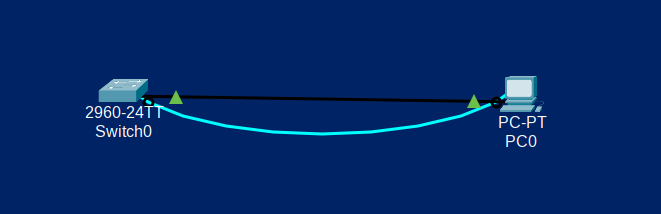
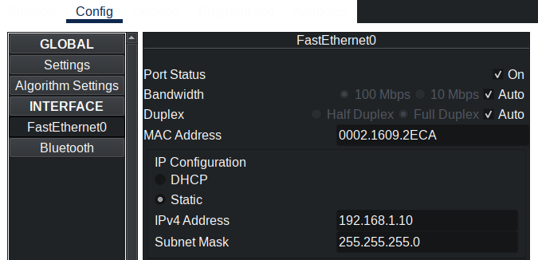
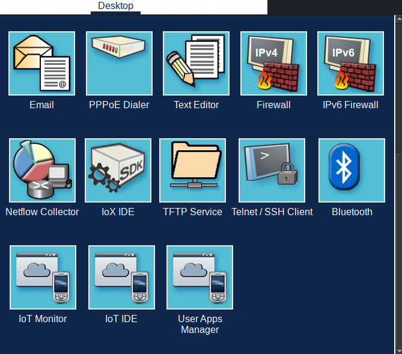
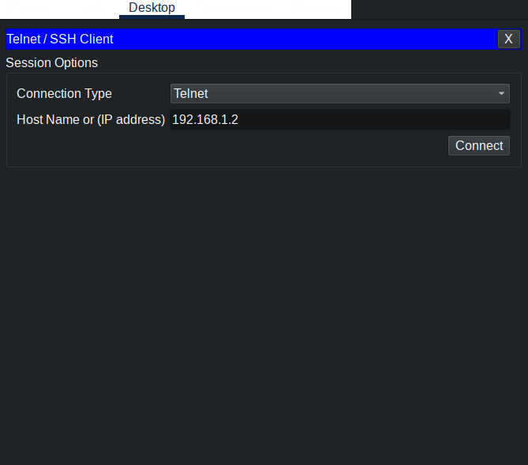
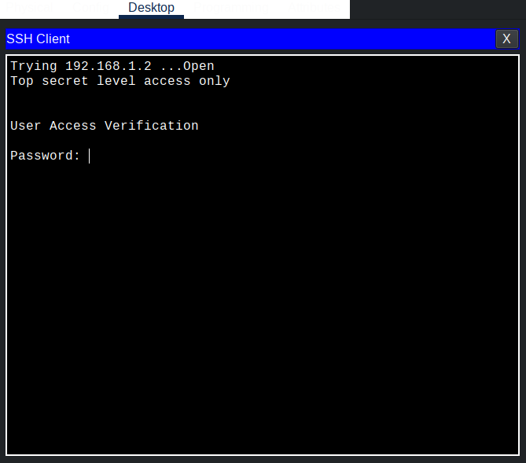

# Базовая настройка коммутатора

---
## Схема устройств


## Задачи
1. Проверка конфигурации коммутатора по умолчанию
2. Создание сети и настройка основных параметров устройства 
    - Настройте базовые параметры коммутатора.
    - Настройте IP-адрес для ПК.
3. Проверка сетевых подключений
    - Отобразите конфигурацию устройства.
    - Протестируйте сквозное соединение, отправив эхо-запрос.
    - Протестируйте возможности удаленного управления с помощью Telnet.

## Решение


### 1. Проверка конфигурации коммутатора по умолчанию

Вводим команду для привелигированного режима(privileged mode).
```bash
enable
```

Затем вводим команду для проверки конфигурации
```bash
show running-config
```

Вывод с командами выше


```
Switch>enable
Switch#
Switch#show running-config

Building configuration...

Current configuration : 1080 bytes
!
version 15.0
no service timestamps log datetime msec
no service timestamps debug datetime msec
no service password-encryption
!
hostname Switch
!
!
!
!
!
!
spanning-tree mode pvst
spanning-tree extend system-id
!
interface FastEthernet0/1
!
interface FastEthernet0/2
!
interface FastEthernet0/3
!
interface FastEthernet0/4
!
interface FastEthernet0/5
!
interface FastEthernet0/6
!
interface FastEthernet0/7
!
interface FastEthernet0/8
!
interface FastEthernet0/9
!
interface FastEthernet0/10
!
interface FastEthernet0/11
!
interface FastEthernet0/12
!
interface FastEthernet0/13
!
interface FastEthernet0/14
!
interface FastEthernet0/15
!
interface FastEthernet0/16
!
interface FastEthernet0/17
!
interface FastEthernet0/18
!
interface FastEthernet0/19
!
interface FastEthernet0/20
!
interface FastEthernet0/21
!
interface FastEthernet0/22
!
interface FastEthernet0/23
!
interface FastEthernet0/24
!
interface GigabitEthernet0/1
!
interface GigabitEthernet0/2
!
interface Vlan1
 no ip address
 shutdown
!
!
!
!
line con 0
!
line vty 0 4
 login
line vty 5 15
 login
!
!
!
!
end
```


### 2. Создание сети и настройка основных параметров устройства 
#### 2.1 Настройте базовые параметры коммутатора.
##### Имя устройства

Поменяем имя устройства на SW-Gavitana-0
```
Switch>enable
Switch#configure terminal
Enter configuration commands, one per line.  End with CNTL/Z.
Switch(config)#hostname SW-Gavitana-0
SW-Gavitana-0(config)#
```
##### Обеспечение безопасности пользовательского режима EXEC


```
SW-Gavitana-0>enable
SW-Gavitana-0#configure terminal
Enter configuration commands, one per line.  End with CNTL/Z.
SW-Gavitana-0(config)#line console 0
SW-Gavitana-0(config-line)#password cisco
SW-Gavitana-0(config-line)#login
```

Пересоздадим сессию терминала чтобы проверить пароль


```
SW-Gavitana-0(config-line)#exit
SW-Gavitana-0(config)#end
SW-Gavitana-0#
%SYS-5-CONFIG_I: Configured from console by console

SW-Gavitana-0#disable
SW-Gavitana-0>exit

Press RETURN to get started!


User Access Verification

Password: // Тут вводим пароль заданный выше (cisco)
```
##### Обеспечение безопасности привилегированного режима EXEC
```
SW-Gavitana-0>enable
SW-Gavitana-0#configure terminal
Enter configuration commands, one per line.  End with CNTL/Z.
SW-Gavitana-0(config)#enable secret class
```
Выйдем из привилегированного режима чтобы проверить пароль
```
SW-Gavitana-0(config)#exit
SW-Gavitana-0#
%SYS-5-CONFIG_I: Configured from console by console
SW-Gavitana-0#disable
SW-Gavitana-0>enable
Password: // Тут вводим пароль заданный выше (class)
```

##### Защита доступа к линии VTY
```
SW-Gavitana-0#configure terminal
Enter configuration commands, one per line.  End with CNTL/Z.
SW-Gavitana-0(config)#line vty 0 15
SW-Gavitana-0(config-line)#password cisco
SW-Gavitana-0(config-line)#login
SW-Gavitana-0(config-line)#end
```
##### Шифрование паролей
```
SW-Gavitana-0#configure terminal
Enter configuration commands, one per line.  End with CNTL/Z.
SW-Gavitana-0(config)#service password-encryption
```
Проверим зашифрованы ли пароли в конфигурации(show running-config).

```
...
line con 0
 password 7 0822455D0A16
 login
!
line vty 0 4
 password 7 0822455D0A16
 login
line vty 5 15
 password 7 0822455D0A16
 login
...
```
##### Баннерные сообщения
Настройка сообщения
```
SW-Gavitana-0>enable
Password: 
SW-Gavitana-0#configure terminal
Enter configuration commands, one per line.  End with CNTL/Z.
SW-Gavitana-0(config)#banner motd #
Top secret level access only#
```

Теперь выйдем из сессии и проверим что сообщени появилось
```
SW-Gavitana-0(config)#
SW-Gavitana-0(config)#end
SW-Gavitana-0#
%SYS-5-CONFIG_I: Configured from console by console

SW-Gavitana-0#disable
SW-Gavitana-0>exit


SW-Gavitana-0 con0 is now available


Press RETURN to get started.


Top secret level access only

User Access Verification

Password: 

SW-Gavitana-0>
```
##### Настройка ip адреса коммутатора на интерфейсе SVI

```
SW-Gavitana-0(config)#interface vlan 1
SW-Gavitana-0(config-if)#ip address 192.168.1.20 255.255.255.0
SW-Gavitana-0(config-if)#no shutdown
```

#### 2.2 Настройте IP-адрес для ПК.

Настраиваем IP на виртуальном PC в packet tracer.

Жмем на PC -> Config -> FastEthernet0 и задаем ip адрес и маску.



### 3. Проверка сетевых подключений
#### 3.1 Отобразите конфигурацию устройства.
```
SW-Gavitana-0#show running-config 
```
Конфигурация 
```
Building configuration...

Current configuration : 1272 bytes
!
version 15.0
no service timestamps log datetime msec
no service timestamps debug datetime msec
service password-encryption
!
hostname SW-Gavitana-0
!
enable secret 5 $1$mERr$9cTjUIEqNGurQiFU.ZeCi1
!
!
!
!
!
!
spanning-tree mode pvst
spanning-tree extend system-id
!
interface FastEthernet0/1
!
interface FastEthernet0/2
!
interface FastEthernet0/3
!
interface FastEthernet0/4
!
interface FastEthernet0/5
!
interface FastEthernet0/6
!
interface FastEthernet0/7
!
interface FastEthernet0/8
!
interface FastEthernet0/9
!
interface FastEthernet0/10
!
interface FastEthernet0/11
!
interface FastEthernet0/12
!
interface FastEthernet0/13
!
interface FastEthernet0/14
!
interface FastEthernet0/15
!
interface FastEthernet0/16
!
interface FastEthernet0/17
!
interface FastEthernet0/18
!
interface FastEthernet0/19
!
interface FastEthernet0/20
!
interface FastEthernet0/21
!
interface FastEthernet0/22
!
interface FastEthernet0/23
!
interface FastEthernet0/24
!
interface GigabitEthernet0/1
!
interface GigabitEthernet0/2
!
interface Vlan1
 ip address 192.168.1.2 255.255.255.0
!
banner motd ^CTop secret level access only^C
!
!
!
line con 0
 password 7 0822455D0A16
 login
!
line vty 0 4
 password 7 0822455D0A16
 login
line vty 5 15
 password 7 0822455D0A16
 login
!
!
!
!
end
```

#### 3.2 Протестируйте сквозное соединение, отправив эхо-запрос.
В командной строке виртуального PC с помощью утилиты ping проверяем связь с адресом PC.

```commandline
C:\>ping 192.168.1.10

Pinging 192.168.1.10 with 32 bytes of data:

Reply from 192.168.1.10: bytes=32 time=1ms TTL=128
Reply from 192.168.1.10: bytes=32 time=3ms TTL=128
Reply from 192.168.1.10: bytes=32 time=2ms TTL=128
Reply from 192.168.1.10: bytes=32 time=3ms TTL=128

Ping statistics for 192.168.1.10:
    Packets: Sent = 4, Received = 4, Lost = 0 (0% loss),
Approximate round trip times in milli-seconds:
    Minimum = 1ms, Maximum = 3ms, Average = 2ms

C:\>
```
В командной строке виртуального PC с помощью утилиты ping проверяем связь с адресом интерфейса SVI коммутатора Switch1(SW-Gavitana-0)
```commandline
C:\>ping 192.168.1.2

Pinging 192.168.1.2 with 32 bytes of data:

Reply from 192.168.1.2: bytes=32 time<1ms TTL=255
Reply from 192.168.1.2: bytes=32 time<1ms TTL=255
Reply from 192.168.1.2: bytes=32 time<1ms TTL=255
Reply from 192.168.1.2: bytes=32 time<1ms TTL=255

Ping statistics for 192.168.1.2:
    Packets: Sent = 4, Received = 4, Lost = 0 (0% loss),
Approximate round trip times in milli-seconds:
    Minimum = 0ms, Maximum = 0ms, Average = 0ms
C:\>
```
#### 3.3 Протестируйте возможности удаленного управления с помощью Telnet.
Жмем на PC -> Desktop -> Telnet/Ssh client



В окне вводим адрес интерфейса SVI коммутатора.


Видим что подлючение удалось

