# Просмотр таблицы MAC-адресов коммутатора

---
## Схема устройств
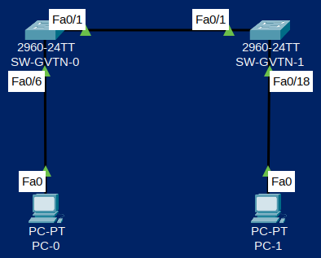

## Таблица адрессации
| Устройство | Интерфейс | IP-адрес     | Маска подсети |
| ---------- | --------- | ------------ | ------------- |
| SW-GVTN-0  | VLAN 1    | 192.168.1.11 | 255.255.255.0 |
| SW-GVTN-1  | VLAN 1    | 192.168.1.12 | 255.255.255.0 |
| PC-0       | NIC       | 192.168.1.1  | 255.255.255.0 |
| PC-1       | NIC       | 192.168.1.2  | 255.255.255.0 |

## Задачи
1. Создание и настройка сети
2. Изучение таблицы МАС-адресов коммутатора

## Решение

### 1. Создание и настройка сети

На основе инструкций из [первой лабораторной](../basic-switch-configuration/README.md) я вручную настроил коммутатор [SW-GVTN-0](SW-GVTN-0_running-config.txt), затем я поменял IP адрес и Hostname в конфиге первого коммутатора, загрузил их на второй коммутатор [SW-GVTN-1](SW-GVTN-1_running-config.txt), после этого перезагрузил устройство.

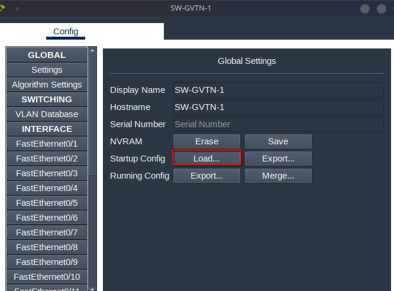

### 2. Изучение таблицы МАС-адресов коммутатора

#### Запишите МАС-адреса сетевых устройств.

Чтобы посмотреть MAC адреса устройств PC-0 и PC-1 адаптера Ethernet откройте командную строку  введите 

```bash
ipconfig /all
```
В выводе команды MAC адрес это Physical Address

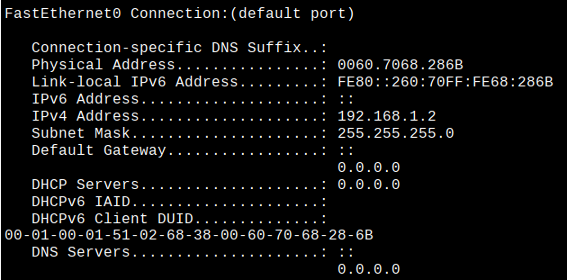

Ниже адреса устройств PC-0 и PC-1

| Устройство | MAC-адрес       |
|------------|-----------------|
| PC-0       | 0060.5CB0.3A63  |
| PC-1       | 0060.7068.286B  |

Чтобы посмотреть MAC адреса устройств SW-GVTN-0 и SW-GVTN-1 интерфейса Fast Ethernet 0/1 откройте командную строку  введите 

```bash
show interface fastEthernet 0/1
```
В выводе команды MAC адрес идёт после `Hardware is Lance, address is`

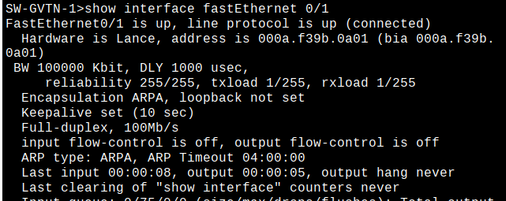


Ниже адреса устройств SW-GVTN-0 и SW-GVTN-1


| Устройство | MAC-адрес       |
|------------|-----------------|
| SW-GVTN-0  | 0050.0fed.2301  |
| SW-GVTN-1  | 000a.f39b.0a01  |


#### Просмотрите таблицу МАС-адресов коммутатора.

Подключился к SW-GVTN-1 и там в привилегированном режиме EXEC введите команду
```bash
show mac address-table 
```

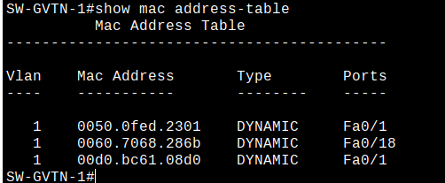

Вопросы и ответы:
Записаны ли в таблице МАС-адресов какие-либо МАС-адреса?
>Да

Какие МАС-адреса записаны в таблице? С какими портами коммутатора они сопоставлены и каким устройствам принадлежат? Игнорируйте МАС-адреса, сопоставленные с центральным процессором.
>Там записаны адрес коммутатора SW-GVTN-0 и адреса PC-0 и PC-1, выше можно увидеть сопоставление адресов и портов.

Если вы не записали МАС-адреса сетевых устройств в шаге 1, как можно определить, каким устройствам принадлежат МАС-адреса, используя только выходные данные команды show mac address-table? Работает ли это решение в любой ситуации?
>В данном случае когда у нас 2 ПК и 2 коммутатора можно определить что это за устройство по порту, первым будет адрес коммутатора SW-GVTN-0, а два остальных это ПК и в зависимости от порта можно понять что это за ПК. Fa0/18 это PC-1 т.к. он подключен к коммутатору SW-GVTN-1 напрямую, а Fa0/1 который последний в списке это PC-0.
Это решение работает только в ситуации когда мы подключаем 1 ПК подключаем к 1 коммутатору и только в случае если каждый следующий ПК подключается к следующему номеру коммутатора(Fa0/1-Fa0/18).

#### Очистите таблицу МАС-адресов коммутатора S2 и снова отобразите таблицу МАС-адресов.
В привилегированном режиме EXEC введите команду 
```bash
clear mac address-table dynamic
```

Это вывод сразу после очистки

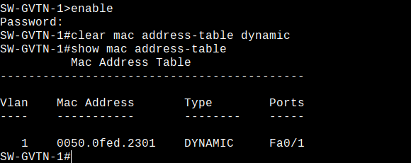

Это вывод через 10 секунд после очистки, ничего не изменилось

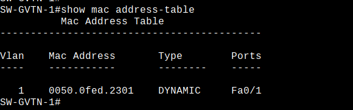


#### С компьютера PC-1 отправьте эхо-запросы устройствам в сети и просмотрите таблицу МАС-адресов коммутатора.

На компьютере PC-1 откройте командную строку и введите arp -a.

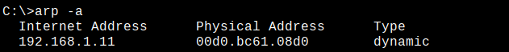

Из командной строки PC-1 отправьте эхо-запросы на компьютер PC-0, а также коммутаторы SW-GVTN-0 и SW-GVTN-1.

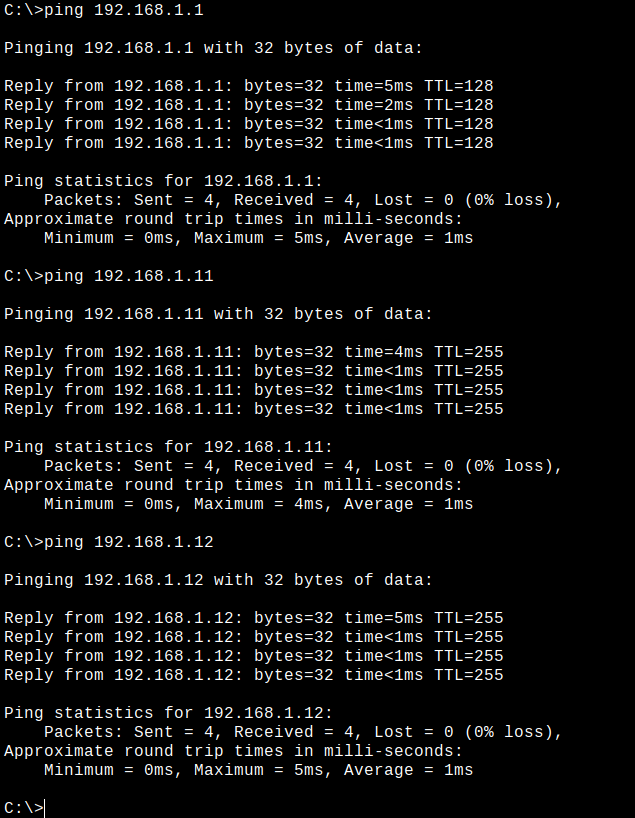

Подключившись через консоль к коммутатору SW-GVTN-1, введите команду show mac address-table.

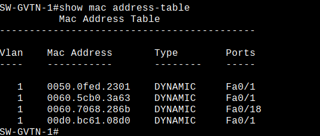

На компьютере PC-1 откройте командную строку и еще раз введите команду arp -a.

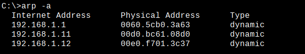